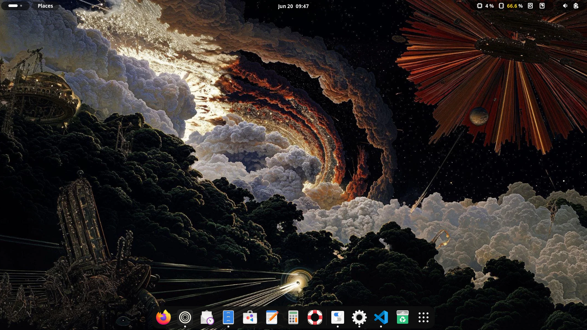
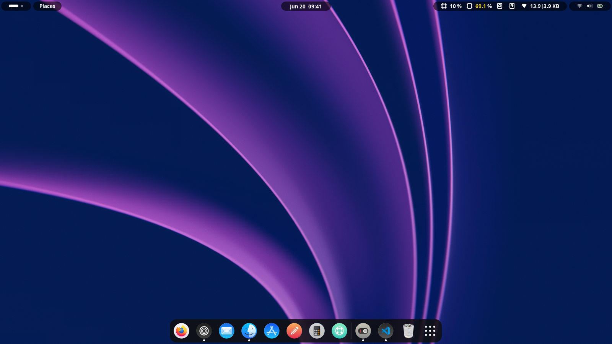
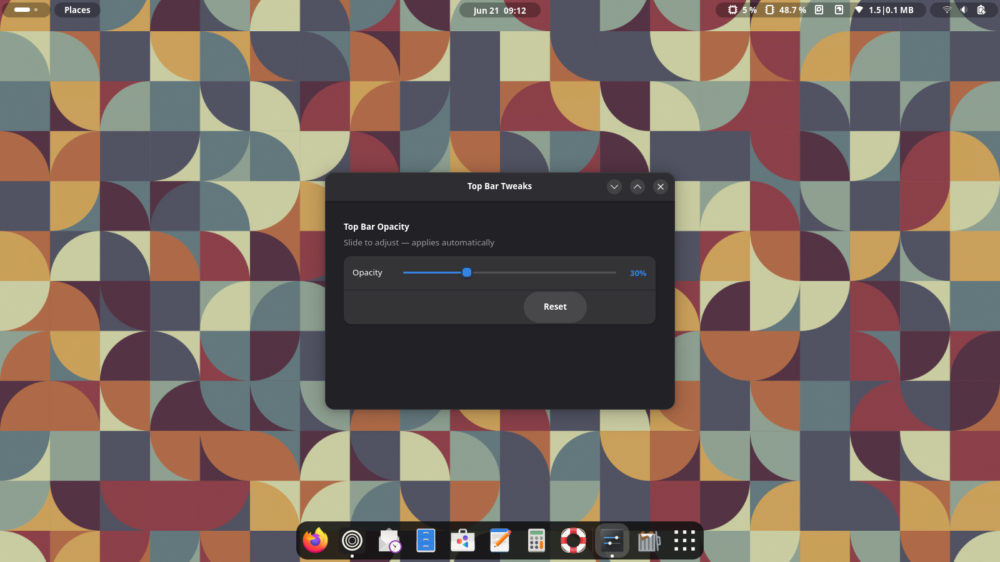
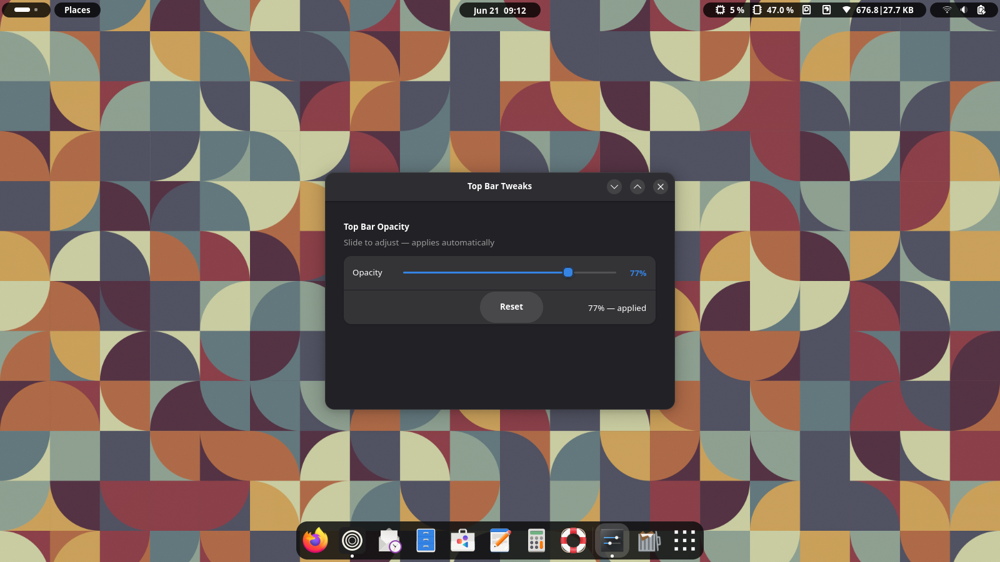

# FlowShell v2

FlowShell is a GNOME Shell theme for GNOME and other GTK-based desktop environments.

## What's New in v2
- Added support for the Top Bar Tweaks app to adjust the top bar opacity.
- Includes updated screenshots showing the theme in action.

## Screenshots





## Top Bar Tweaks
The new feature works with the Top Bar Tweaks app to adjust the opacity of the top bar.





## Usage
- To install the theme system-wide (requires administrative rights), run:

```bash
bash install.sh
```

- Or, if the file is executable:

```bash
./install.sh
```

- The `install.sh` script installs the theme system-wide (may prompt for sudo).

## Prerequisites
- Ubuntu/Debian and distributions without `dconf` preinstalled: install it with:

```bash
sudo apt install dconf-cli
```

- Fedora and other distributions that already include `dconf`: no additional package is needed.

License
- This project is licensed under the MIT License. See `LICENSE`.

Contributing
- Please read `CONTRIBUTING.md` for guidelines on contributing and reporting issues.
